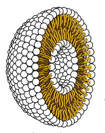
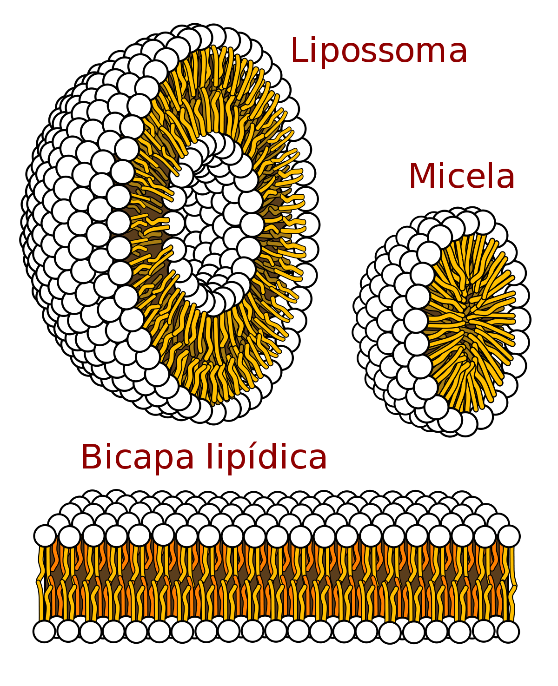
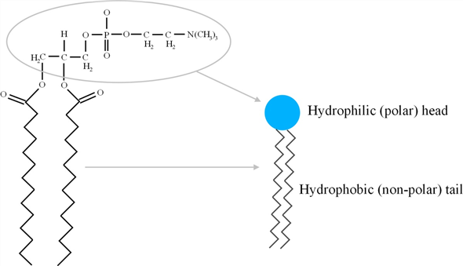
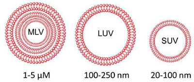
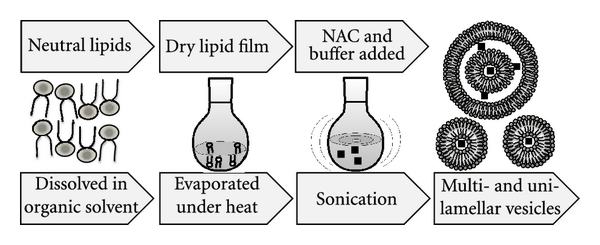

<!-- .slide: data-state="no-toc-progress" --> <!-- don't show toc progress bar on this slide -->

# Lipossomas

----

## Diego Silva

Graduando em Biotecnologia

diegosilva@ufu.br

----  ----

# Definição

Os lipossomas são pequenas vesículas artificiais de forma esférica que podem ser criadas a partir de colesterol e fosfolipídios.

----

## Contexto histórico

Eles são considerados os sistemas nanocarreadores mais antigos, descobertos em meados da década de 1960 por Alec Bangham.

----

## Visão 3D

----

## Lipossoma X Micela

----

## Fosfolipídios

----  ----

# Classificação

Um lipossoma pode ser classificado pela estrutura de sua membrana.

----

## Multilamelar e Unilamelar

----

## Lipossoma Multilamelar

Os lipossomas multilamelares (MLV) possuem uma estrutura em formato de cebola, ou seja, várias bicamadas aninhadas.

----

## Lipossoma Unilamelar

Os limpossomas unilamelares possuem apenas uma bicamada, mas podem ser classificados em dois tipos grandes (LUV) e pequenos (SUV).

----  ----

# Síntese e Loading

Todos os métodos de preparação dos lipossomas envolvem quatro estágios básicos:

1. Secar os lípidos do solvente orgânico.
2. Dispersão do lipídio em meio aquoso.
3. Purificando o lipossoma resultante.
4. Analisando o produto final.

----

# Síntese - Passivo

Os metodos de preparação passivos consistem em:
* Dispersão mecânica
* Dispersão no solvente
* Remoção por detergente (Utilizado para remover material não encapsulado)

----

# Dispersão Mecânica

A dispersão mecânica pode ser feita através do método da Sonicação, que consiste em utilizar ultra-som para agitar os elementos.

----

# Síntese - Sonicação

----  ----

# Aplicação

----

## Modelo de Membrana

Sistemas de membrana modelo para estudar a natureza básica das membranas celulares.

[Formation of solid-supported lipid bilayers: an integrated view](https://www.ncbi.nlm.nih.gov/pubmed/16584220)

----

## Bioquímica e Biologia Celular

* Analito: quando o lipossoma ou seus componentes são os objetos da análise;

* Ferramenta analítica: quando os lipossomas influenciam em alguma etapa do processo analítico.

----

## Lipossoma como Ferramentas Analíticas

São utilizados principalmente para melhorar as propriedades analíticas, particularmente a sensibilidade, devido à sua utilidade como reagentes de amplificação de sinal e podem aumentar a selectividade quando são utilizados como dispositivos de transporte.

----

## Lipossoma como Ferramentas Analíticas

Em [The role of liposomes in analytical processes](https://www.sciencedirect.com/science/article/pii/S016599360403064X#BIB80) Agustina Gómez-Hens, Juan Manuel e Fernández-Romero utilizaram lipossomas em combinação com um eletrodo revestido com lipídios reduzindo a resposta do eletrodo a interferentes, como o ascorbato.

----

## Tecnologias Microfluídicas

Em [Fluorescent liposome flow markers for microscale particle-image velocimetry.](https://www.ncbi.nlm.nih.gov/pubmed/11289418) Singh, Cummings e Throckmorton utilizaram lipossomas unilamelares como novos marcadores fluorescentes para perfis de fluxo de imagem em estruturas microfabricadas.

----

## Produção de Nanogel

[Neste artigo](https://www.ncbi.nlm.nih.gov/pubmed/19081576) Os lipossomas foram utilizados como moldes para preparar nanopartulas de hidrogel de polietilenoglicol.

----

## Coméstico

Os lipossomas também podem atuar como carreadores dérmicos, por serem pequenos, unilamelares e possuirem a flexibilidade de uma membrana. Os lipossomas são usados em aplicações dérmicas, como sistemas de proteção para ingredientes ativos ou para suas propriedades hidratantes. [Role of liposomal drug-delivery system in cosmetics](https://www.sciencedirect.com/science/article/pii/B978032342868200005X)

----

## Industria e Alimentos

Em [Ferrous sulfate liposomes: preparation, stability and application in fluid milk](https://www.sciencedirect.com/science/article/pii/S0963996904002480) foram realizados testes de estabilização de lipossomas carregando sulfato ferroso e adição desses lipossomas no leite.

----

## Exames por Imagem

Em [Radiolabeled liposomes for scintigraphic imaging](https://www.ncbi.nlm.nih.gov/pubmed/11082507) foi realizada uma revisão sobre a aplicação de lipossomas nas imagens por cintilografia.

----

## Entrega de medicamentos

Como os lipossomas possuem uma estrutura nanométrica, torna-se possível aumentar a especificada dos medicamentos, reduzir os efeitos colaterias e com o aumento da efetividade, reduzir a dose de medicamento necessário. [Referência](http://rsif.royalsocietypublishing.org/content/7/Suppl_1/S55?ijkey=c62b2a7295fada188e135b8a43747fff492a8fe7&keytype2=tf_ipsecsha)

----

## Entrega de medicamentos

A baixa biodisponibilidade muitas vezes limita o uso de medicamentos e, como resultado, eles são  utilizados ​​em doses muito altas.

----

## Entrega de medicamentos

O encapsulamento de moléculas biologicamente ativas em nanotransportadores pode aumentar sua biodisponibilidade e induzir liberação sustentada. A droga pode ser protegida contra a degradação e seu transporte na barreira biológica pode ser alterado, e ainda é possível controlar os processos de absorção.

----

## Entrega de medicamentos

Em [Designing of ‘intelligent’ liposomes for efficient delivery of drugs](https://onlinelibrary.wiley.com/doi/abs/10.1111/j.1582-4934.2002.tb00450.x) é apresentado uma revisão bibliográfica sobre o estudo dos lipossomas na entrega de medicamentos.

----  ----

# Conclusão

----  ----

# Referencial Teórico

----  ----
